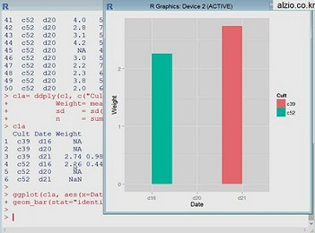

이력서
========
이름 | **용권순**  
--|--------
생년월일 | 1999/07/11  
학교 | 한림대학교  
학과 | 소프트웨어융합대학 
학년 | 1학년
주 사용언어 | 자바  
직전학기 학점| 3.98
---------------
##### 관심분야
   
(1)빅데이터 그래프

-------------------------------
##### 전공 수강과목
* 오픈소스리눅스  
* 자바  
* 파이썬
* _(new) 선형대수학_
----------------
##### 자격증
1. 운전면허증 (1종 보통)
2. 제과자격증  
--------------------
##### 취미
1.유튜브  
2.만화  
3.음악감상 및 부르기  
4.독서 
--------------
###

-------------
##### 사진 및 출처
(1) http://www.alzio.co.kr/contents/Category_Main.php?gb=2&dp1=138&dp2=571
